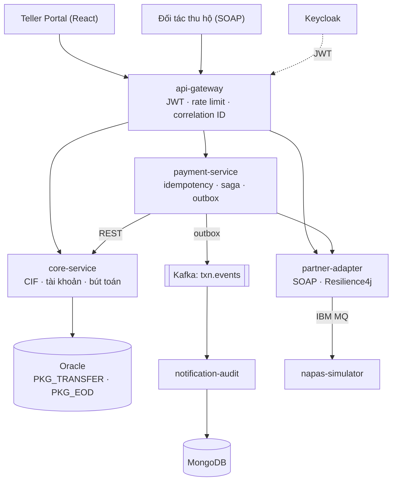

# MiniCore

Core banking thu nhỏ và lớp tích hợp API, viết bằng Java 21 + Spring Boot 3 + Oracle.

> **Trạng thái:** đang phát triển — tuần 2/8. Hiện có: đặc tả nghiệp vụ, thiết kế kiến trúc, CSDL Oracle, package PL/SQL chuyển khoản, core-service (Spring Boot) với API khách hàng, tài khoản và chuyển khoản nội bộ.

## Mục tiêu

Mô phỏng lõi ngân hàng (CIF khách hàng, tài khoản, hạch toán kép, chuyển khoản, tính lãi cuối ngày) và lớp tích hợp API cho kênh giao dịch tại quầy, kênh số và đối tác bên ngoài.

## Kiến trúc



Nguyên tắc: mọi lời gọi đi qua gateway; chỉ core-service được ghi tiền vào Oracle; partner-adapter cô lập mọi giao tiếp với bên ngoài để lỗi đối tác không lan vào lõi.

## Tech stack

| Lớp | Công nghệ |
|---|---|
| Ngôn ngữ / Framework | Java 21, Spring Boot 3, Spring Data JPA, Spring Cloud Gateway |
| CSDL | Oracle Database 23ai Free, PL/SQL, Flyway |
| NoSQL | MongoDB (audit log), Redis (cache, rate limit, idempotency) |
| Message | Kafka (sự kiện nội bộ), IBM MQ + JMS (liên ngân hàng) |
| Web service | REST (OpenAPI), SOAP (WSDL) |
| Bảo mật / Resilience | Keycloak (OAuth2/JWT), Resilience4j |
| Kiểm thử | JUnit 5, Mockito, Testcontainers, k6 |

## Cấu trúc repo

```
docs/spec/       Đặc tả nghiệp vụ + sequence diagram
db/migration/    Script schema (đặt tên theo chuẩn Flyway)
db/plsql/        Package PL/SQL
core-service/    Spring Boot: API khách hàng, tài khoản, chuyển khoản (gọi PKG_TRANSFER)
```

## Chạy CSDL local

```bash
docker run -d --name minicore-oracle -p 1521:1521 \
  -e ORACLE_PASSWORD=Oracle123 \
  -e APP_USER=minicore -e APP_USER_PASSWORD=minicore123 \
  gvenzl/oracle-free:23-slim-faststart
```

Kết nối: `localhost:1521`, service `FREEPDB1`, user `minicore`. Chạy lần lượt `db/migration/V1__init_schema.sql`, `V2__seed_data.sql`, rồi `db/plsql/pkg_transfer.sql`.

## Chạy core-service

Cần JDK 21 và Maven (IntelliJ có sẵn Maven). Oracle phải đang chạy và đã có schema như trên.

```bash
cd core-service
mvn test             # unit test, không cần Oracle
mvn spring-boot:run  # chạy ở cổng 8081
```

Swagger UI: http://localhost:8081/swagger-ui.html · Request mẫu cho 5 case: `core-service/requests.http`. Chi tiết: [core-service/README.md](core-service/README.md).

## Quy ước

- Tiền: `NUMBER(19,2)` trong Oracle, `BigDecimal` trong Java — không dùng `double`.
- Mã lỗi dạng `MC-xxxx`, response chuẩn `{ code, message, data, traceId, timestamp }`.
- Git Flow: `feature/*` → Pull Request vào `develop` → cuối tuần merge vào `main` và gắn tag.

## Lộ trình

- [x] Tuần 1: đặc tả, kiến trúc, schema Oracle, `PKG_TRANSFER`
- [x] core-service: API khách hàng, tài khoản, chuyển nội bộ gọi `PKG_TRANSFER`, response và mã lỗi chuẩn, Swagger, unit test
- [ ] core-service: nộp/rút, sao kê, integration test với Oracle thật, test chuyển song song
- [ ] payment-service + api-gateway (Idempotency-Key, JWT, rate limit) — mốc MVP
- [ ] Kafka + outbox, notification-audit (MongoDB)
- [ ] partner-adapter: saga liên ngân hàng, Resilience4j, SOAP
- [ ] `PKG_EOD` tính lãi cuối ngày, IBM MQ, teller portal
- [ ] SIT tự động trong CI, load test k6
- [ ] Hoàn thiện tài liệu, ADR, video demo