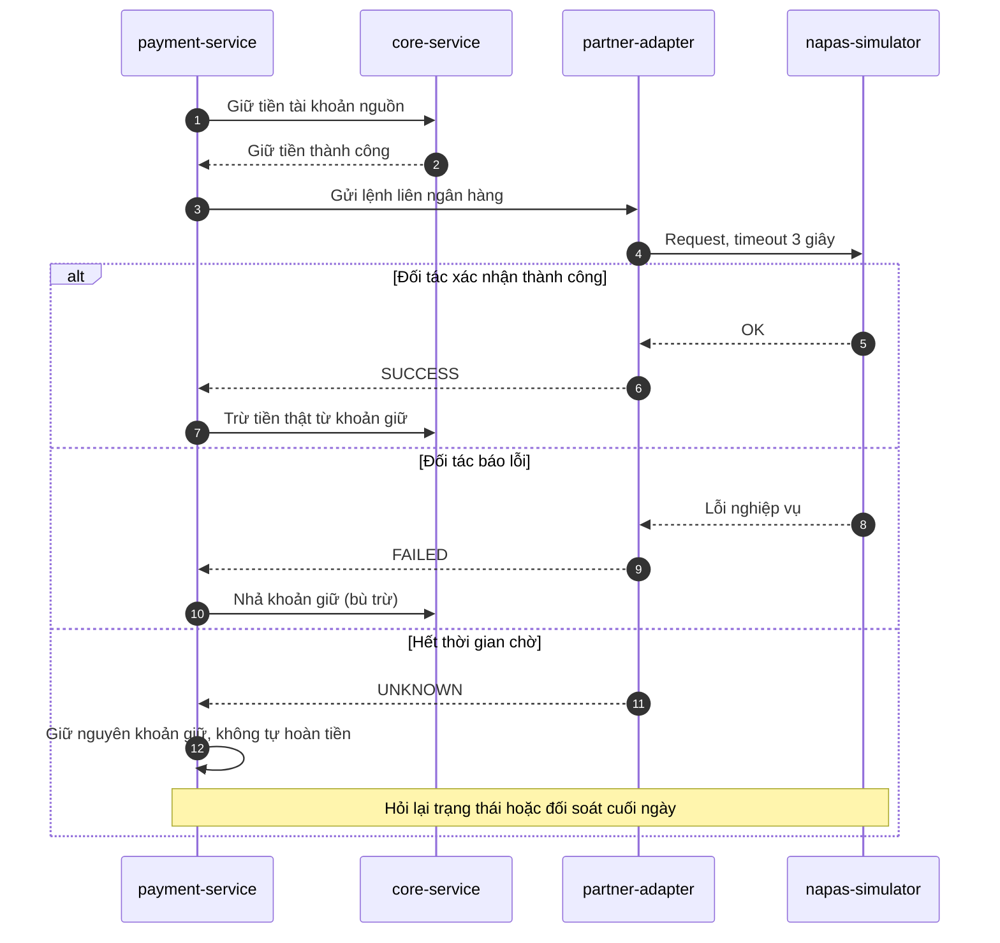

# Đặc tả: Chuyển khoản liên ngân hàng (saga)

## Nguyên tắc
- Không dùng 2PC vì không kiểm soát được hệ thống đối tác; dùng saga: giữ tiền → gửi đối tác → trừ thật hoặc nhả giữ.
- Timeout khi gọi đối tác **không** được hiểu là thất bại: chuyển sang trạng thái UNKNOWN, giữ nguyên hold, không tự hoàn tiền.
- Chỉ retry lệnh hỏi trạng thái, không retry lệnh ghi tiền.

## Trạng thái
`PENDING → SUCCESS | FAILED | UNKNOWN`; UNKNOWN được giải quyết bằng hỏi lại trạng thái hoặc đối soát cuối ngày.

## Luồng xử lý

