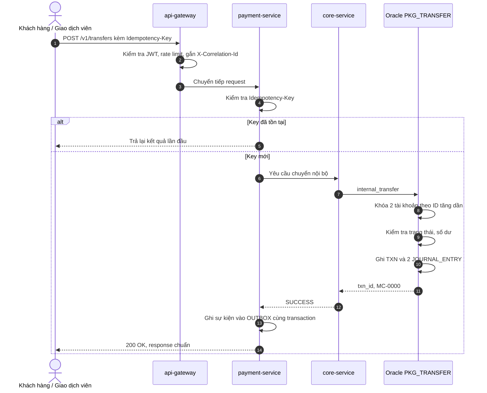

# Đặc tả: Chuyển khoản nội bộ

## Mô tả
Chuyển tiền giữa hai tài khoản cùng ngân hàng, hạch toán kép (tổng Nợ = tổng Có), thực hiện trong một transaction.

## Đầu vào — `POST /v1/transfers`
| Trường | Kiểu | Bắt buộc | Ghi chú |
|---|---|---|---|
| Header `Idempotency-Key` | string ≤ 40 | Có | Lưu thành `txn_ref`, chống trừ tiền trùng |
| fromAccount | string | Có | Số tài khoản nguồn |
| toAccount | string | Có | Số tài khoản đích |
| amount | decimal(19,2) | Có | > 0 |
| channel | enum | Có | TELLER / DIGITAL / PARTNER |
| description | string ≤ 500 | Không | |

## Quy tắc nghiệp vụ
1. Tài khoản nguồn khác tài khoản đích, cùng loại tiền.
2. Cả hai tài khoản ở trạng thái ACTIVE.
3. Số dư khả dụng = `balance - hold_amount` phải ≥ `amount`.
4. Khóa hai tài khoản theo thứ tự `account_id` tăng dần để tránh deadlock khi có lệnh ngược chiều chạy đồng thời.
5. Ghi 1 dòng `TXN` + 2 dòng `JOURNAL_ENTRY` (D cho nguồn, C cho đích).
6. Trùng `Idempotency-Key`: không trừ tiền lần hai, trả lại kết quả của lần đầu.
7. Giao dịch trên 100.000.000 VND tại quầy cần kiểm soát viên duyệt (maker-checker) — triển khai ở giai đoạn sau.

## Mã lỗi
| Mã | Ý nghĩa |
|---|---|
| MC-0000 | Thành công |
| MC-1001 | Tài khoản nguồn không tồn tại |
| MC-1002 | Tài khoản đích không tồn tại |
| MC-1003 | Tài khoản bị phong tỏa hoặc đã đóng |
| MC-1004 | Số dư khả dụng không đủ |
| MC-1005 | Số tiền không hợp lệ |
| MC-1006 | Trùng mã giao dịch |
| MC-1007 | Tài khoản nguồn trùng tài khoản đích |
| MC-1008 | Khác loại tiền |
| MC-9999 | Lỗi hệ thống (do tầng ứng dụng gán khi DB ném lỗi) |

## Luồng xử lý

